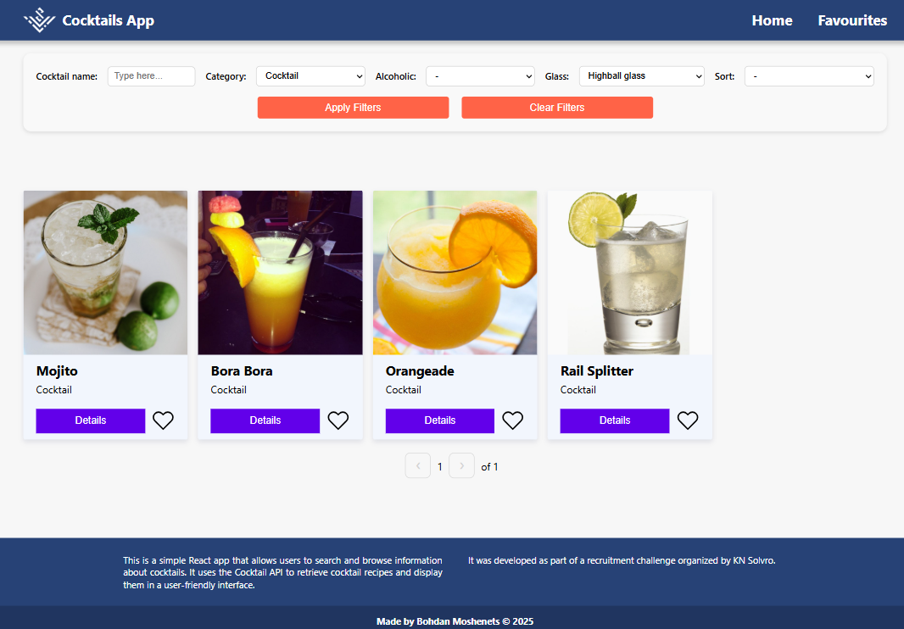
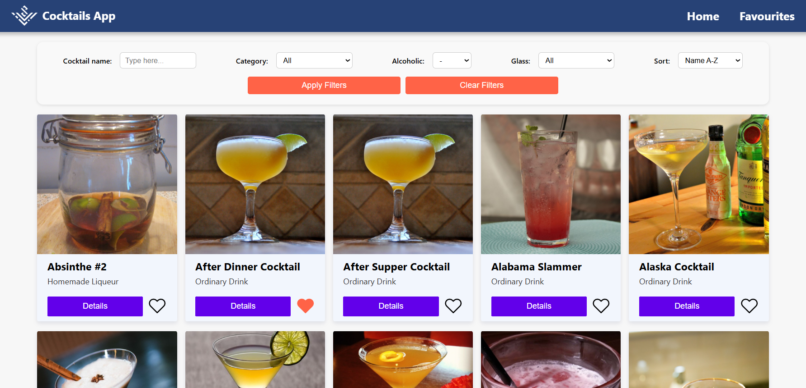
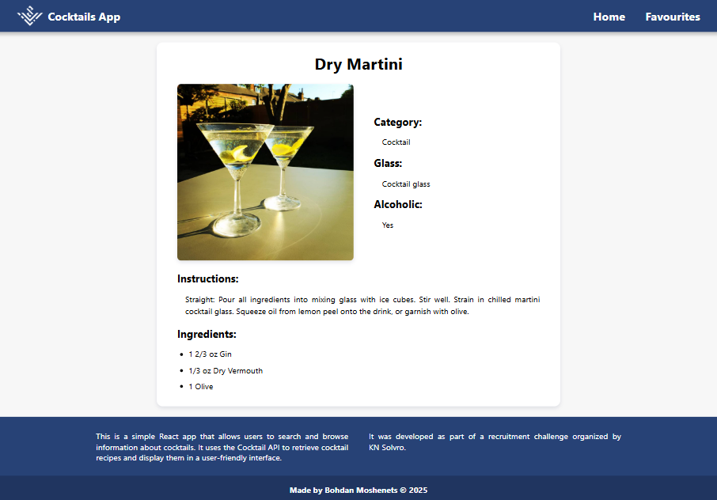
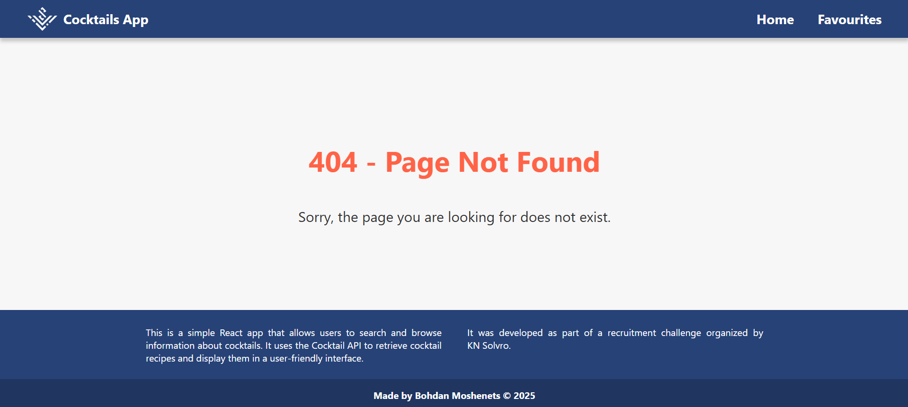
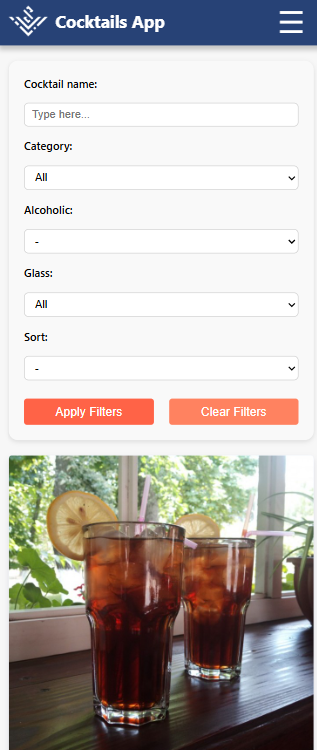
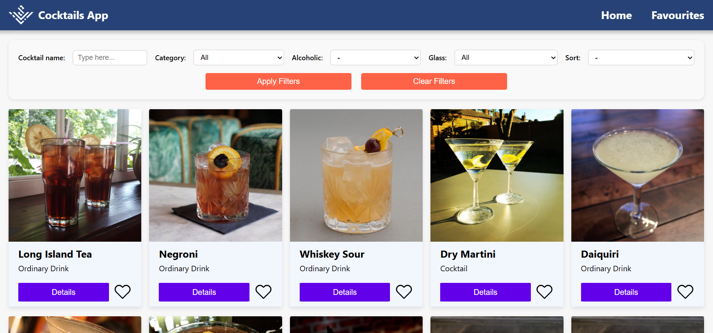

# 🍹 Cocktails Frontend

A web application developed as a recruitment task for the Frontend Section of [KN Solvro](https://github.com/Solvro).

The project allows users to search for cocktails, sort and filter them, browse drinks by categories, and view detailed cocktail recipes.  
It fetches cocktail data from the [Cocktails API](https://cocktails.solvro.pl) provided by KN Solvro.

---

## 🔧 Technologies

- ReactJS
  - **useContext**
  - **useEffect**
  - **useState**
  - **react-router-dom**
- CSS
- JavaScript
- Cocktails API

---

## 🚀 Features

- 🔍 **Search cocktails by name**
- 📊 **Sort cocktails** by different parameters (name, category, glass, etc.)
- 🧃 **Filter cocktails** by categories
- ⭐ **Add cocktails to favorites**
- 📋 View detailed drink information
- ⚠️ **Error handling** – dedicated error screen for cases like 404 or failed API requests
- 📱 **Responsive design** – different layout optimized for mobile and desktop devices

## 📸 Screenshots

> Screenshots highlighting the main features of the application:

### 🔍 Search & Filters

### 📊 Sorting

### ⭐ Favorites

### 📋 Cocktail details

### ⚠️ Error screen

### 📱 Mobile vs Desktop
Mobile view:  

Desktop view:  

---

## 👤 Author

GitHub [@moshenetsb](https://github.com/moshenetsb)
